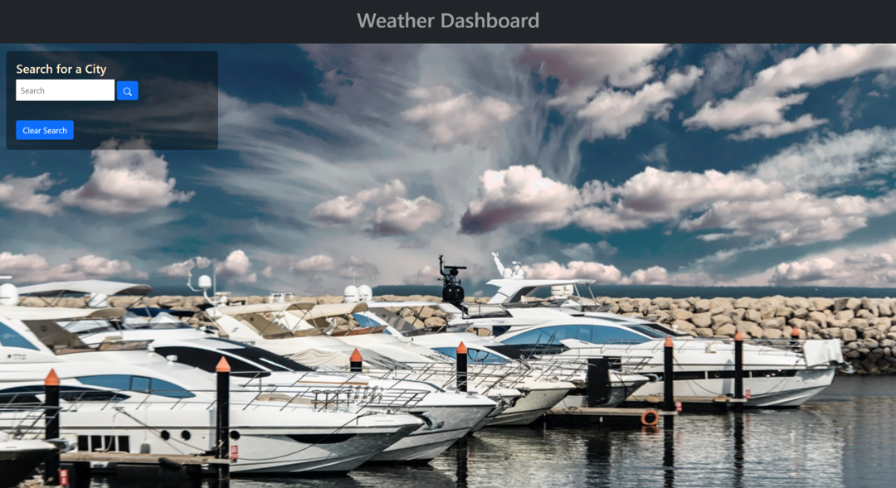
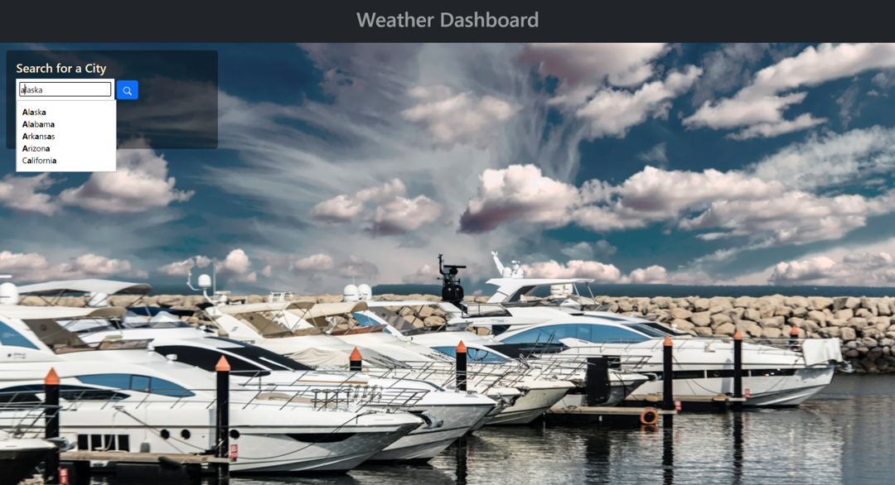
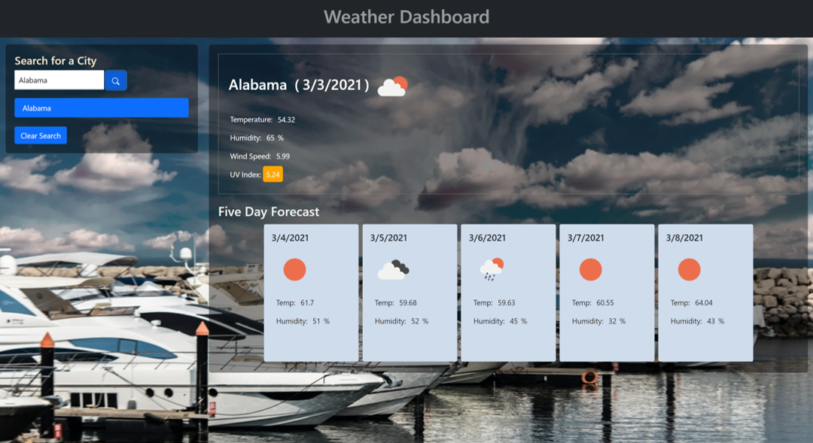
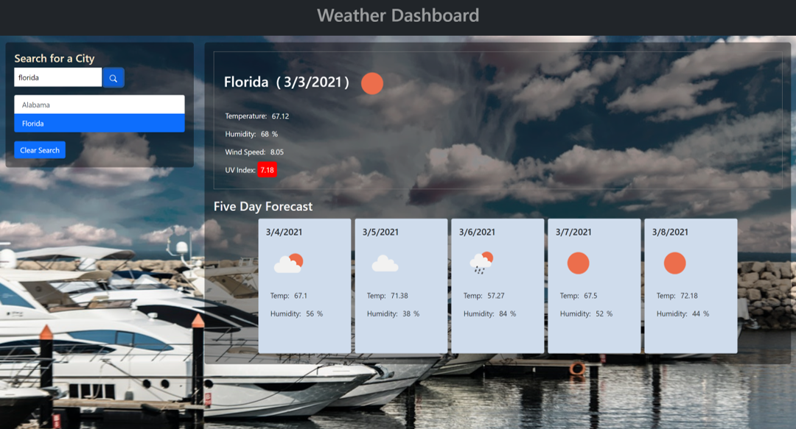
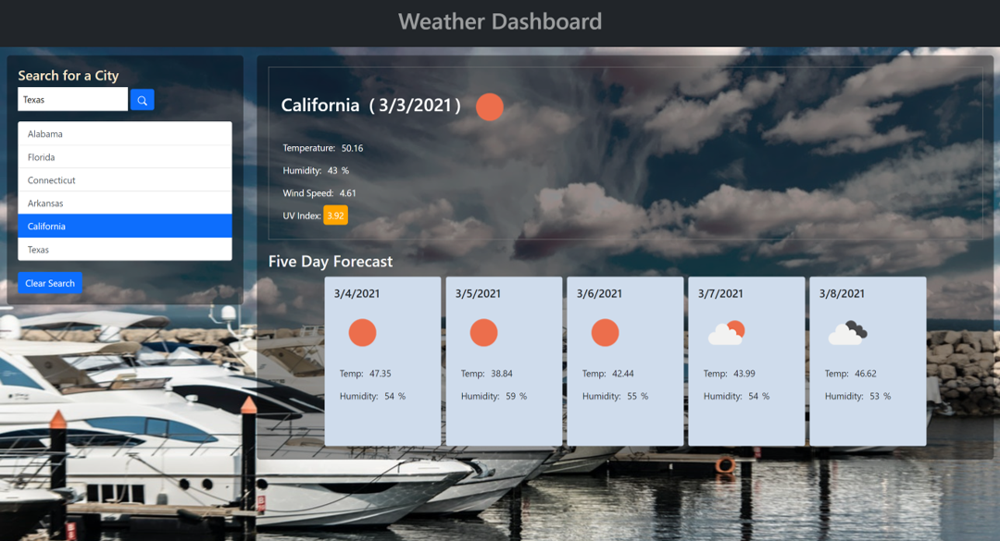
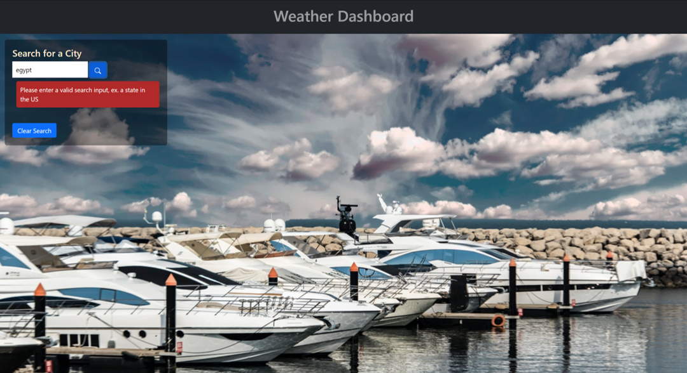

# Weather-Dashboard
## Project Overview:
This weather dashboard is designed for the user to be able to check the weather conditions for the current day and be able to see the forecast for up to five days.

The application can be accessed through: [Weather Dashboard](https://nohaashraf85.github.io/Weather-Dashboard/)

## Technologies Used:
1. html
2. Bootstrap
3. CSS
4. javascript
5. jQuery
6. moment.js
7. Open Weather API
8. Typeahead add on

## How it works:
Upon accessing the Weather Dashboard the user is presented with a clean interface that includes a simple header and a Search box

Using the search box the user can type a State name in the US, where the user will be presented with the typeahead feature where a drop box will appeare and provide the user with options with states that include the letter that was typed in the search

When the user chooses a state from the drop down menu or continue typing manually, the user then shall press on the search button, upon clicking on the search button the main section of the page is populated with the weather information for the current day and a forecast for 5 days. The date presented in cludes:
* Temperature
* Humidity
* Wind Speed
* UV Index that provides further information using color coding to weather the conditions are good, red for danger, green for favorable conditions and orange for warning
* an icon that represents the weather condition

While the five day forecast provides:
* Temperatuer
* Humidity
* an icon that represents the weather condition

Should the user wish to attempt a new search, the search box is used and the user can select or type a new state, upon the weather data being displayed the user will notice the the new search is added to the sidebar list. Each time the user searches for a new state, it is added to the sidebar and the current displayed state is highlighted in the sidebar in blue to indicate that this is the information displayed. 

Any time the user wished to navigate between the weather conditions of previously searched states, the user can click on the name of the state in the sidebar which in turn will be highlighted in blue for an easy experience, this is achieved through local storage

If the searched states in the sidebar become too many and the user would like to clear this search using the Clear Search button below the sidebar

Another scenario that has been taken into consideration, is in case the user types an invalid search input, in our case a search that is not a state in the US, the user shall be presented with a warning that directs the user to the valid search criteria

